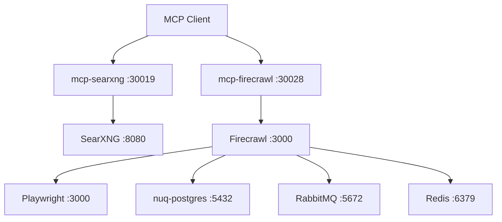

<div align="center">

# MCP Search

Containerized search and web scraping infrastructure powered by Model Context Protocol

[](LICENSE)
[](https://docs.docker.com/compose/)
[](https://github.com/redis/redis)
[](https://github.com/rabbitmq/rabbitmq-server)
[](https://github.com/searxng/searxng)
[](https://github.com/ihor-sokoliuk/mcp-searxng)
[](https://github.com/firecrawl/firecrawl)
[](https://github.com/firecrawl/firecrawl-mcp-server)
[](https://github.com/microsoft/playwright)
[](https://modelcontextprotocol.io/)

</div>

## Overview

MCP Search is a containerized infrastructure that provides web search and URL scraping capabilities through the Model Context Protocol (MCP). It combines SearXNG (privacy-respecting metasearch engine) and Firecrawl (web scraping API) with their respective MCP servers, backed by Redis, PostgreSQL, RabbitMQ, and Playwright.

### Architecture



### Services

| Service           | Image                            | Port         | Description                                             |
| ----------------- | -------------------------------- | ------------ | ------------------------------------------------------- |
| **searxng**       | `searxng/searxng`                | 8080         | Privacy-respecting metasearch engine (web UI available) |
| **mcp-searxng**   | `isokoliuk/mcp-searxng`          | 30019        | MCP server for SearXNG API                              |
| **firecrawl**     | `ghcr.io/firecrawl/firecrawl`    | 3000         | Web scraping and crawling API                           |
| **mcp-firecrawl** | `mcp/firecrawl`                  | 30028        | MCP server for Firecrawl API                            |
| **redis**         | `redis:7-alpine`                 | 6379         | Cache and rate limiting                                 |
| **nuq-postgres**  | `ghcr.io/firecrawl/nuq-postgres` | 5432         | PostgreSQL for Firecrawl                                |
| **playwright**    | `mcr.microsoft.com/playwright`   | 3000         | Headless browser for JS rendering                       |
| **rabbitmq**      | `rabbitmq:3-management`          | 5672 / 15672 | Message broker for Firecrawl                            |

## Usage

### Requirements

| Dependency                          | Minimum Version |
| ----------------------------------- | --------------- |
| **Docker or Podman (with compose)** | `23.0` / `5.0`  |
| **Bash**                            | `5.0`           |
| **OpenSSL**                         | `3.x`           |

### Quick Start

1. Clone the repository:

```bash
git clone https://github.com/Mournweiss/mcp-search.git
cd mcp-search
```

2. Run the build script:

```bash
chmod +x build.sh
./build.sh
```

The script will:

- Create `.env` from `.env.example` if it doesn't exist
- Sync missing variables from the template
- Generate secrets (`SEARXNG_SECRET_KEY`, `POSTGRES_PASSWORD`, etc.)
- Build and start all services in detached mode

#### Arguments

```text
--podman, -p          Use podman-compose instead of docker-compose
--docker, -d          Use docker-compose explicitly
--foreground, -f      Run in foreground mode (attach logs)
--no-keygen, -n       Skip secret generation
--help, -h            Show help message
```

3. Connect to LLM:

    Both MCP servers run as streamable HTTP endpoints.

    | Server            | Endpoint                     | Transport       |
    | ----------------- | ---------------------------- | --------------- |
    | **mcp-searxng**   | `http://localhost:30019/mcp` | Streamable HTTP |
    | **mcp-firecrawl** | `http://localhost:30028/mcp` | Streamable HTTP |

#### Claude Desktop

Config file: `~/Library/Application Support/Claude/claude_desktop_config.json` (macOS) or `%APPDATA%\Claude\claude_desktop_config.json` (Windows)

Claude Desktop uses stdio transport natively, so remote HTTP servers require the `mcp-remote` bridge package:

```json
{
    "mcpServers": {
        "searxng": {
            "command": "npx",
            "args": ["-y", "mcp-remote@latest", "http://localhost:30019/mcp"]
        },
        "firecrawl": {
            "command": "npx",
            "args": ["-y", "mcp-remote@latest", "http://localhost:30028/mcp"]
        }
    }
}
```

Restart Claude Desktop after saving.

#### Cursor

Config file: `~/.cursor/mcp.json`

Cursor supports native HTTP transport:

```json
{
    "mcpServers": {
        "searxng": {
            "url": "http://localhost:30019/mcp"
        },
        "firecrawl": {
            "url": "http://localhost:30028/mcp"
        }
    }
}
```

#### VS Code (GitHub Copilot)

Config file: `.vscode/mcp.json` (workspace) or `~/.vscode/mcp.json` (user-level)

```json
{
    "servers": {
        "searxng": {
            "type": "http",
            "url": "http://localhost:30019/mcp"
        },
        "firecrawl": {
            "type": "http",
            "url": "http://localhost:30028/mcp"
        }
    }
}
```

#### Cline (VS Code Extension)

In Cline settings:

```json
{
    "mcpServers": {
        "searxng": {
            "command": "npx",
            "args": ["-y", "mcp-remote@latest", "http://localhost:30019/mcp"]
        },
        "firecrawl": {
            "command": "npx",
            "args": ["-y", "mcp-remote@latest", "http://localhost:30028/mcp"]
        }
    }
}
```

#### Windsurf (Codeium)

Config file: `~/.codeium/windsurf/mcp_config.json`

```json
{
    "mcpServers": {
        "searxng": {
            "command": "npx",
            "args": ["-y", "mcp-remote@latest", "http://localhost:30019/mcp"]
        },
        "firecrawl": {
            "command": "npx",
            "args": ["-y", "mcp-remote@latest", "http://localhost:30028/mcp"]
        }
    }
}
```

Reload the Windsurf window after saving.

## Environment Variables

All configuration is managed through `.env`. See `.env.example` for the full list of variables.

Primary variables:

| Variable                   | Default                  | Description                   |
| -------------------------- | ------------------------ | ----------------------------- |
| `PROJECT_NAME`             | `mcp-search`             | Docker Compose project prefix |
| `LOG_LEVEL`                | `info`                   | Global log level              |
| `SEARXNG_PORT`             | `8080`                   | SearXNG HTTP port             |
| `MCP_SEARXNG_PORT`         | `30019`                  | MCP SearXNG server port       |
| `FIRECRAWL_PORT`           | `3000`                   | Firecrawl API port            |
| `MCP_FIRECRAWL_PORT`       | `30028`                  | MCP Firecrawl server port     |
| `RABBITMQ_PORT`            | `5672`                   | RabbitMQ port                 |
| `RABBITMQ_MANAGEMENT_PORT` | `15672`                  | RabbitMQ management UI port   |
| `SEARXNG_ENGINES`          | `google,duckduckgo,bing` | Search engines to enable      |
| `SEARXNG_CATEGORIES`       | `general,it,science`     | Search categories             |

## License

This project uses AGPL-3.0 licensed components. See individual repositories for their respective licenses:

- [SearXNG](https://github.com/searxng/searxng) - AGPL-3.0
- [mcp-searxng](https://github.com/ihor-sokoliuk/mcp-searxng) - MIT
- [Firecrawl](https://github.com/firecrawl/firecrawl) - AGPL-3.0
- [firecrawl-mcp-server](https://github.com/firecrawl/firecrawl-mcp-server) - MIT
- [Redis](https://github.com/redis/redis) - BSD
- [Playwright](https://github.com/microsoft/playwright) - Apache-2.0
- [RabbitMQ](https://github.com/rabbitmq/rabbitmq-server) - MPL-2.0
